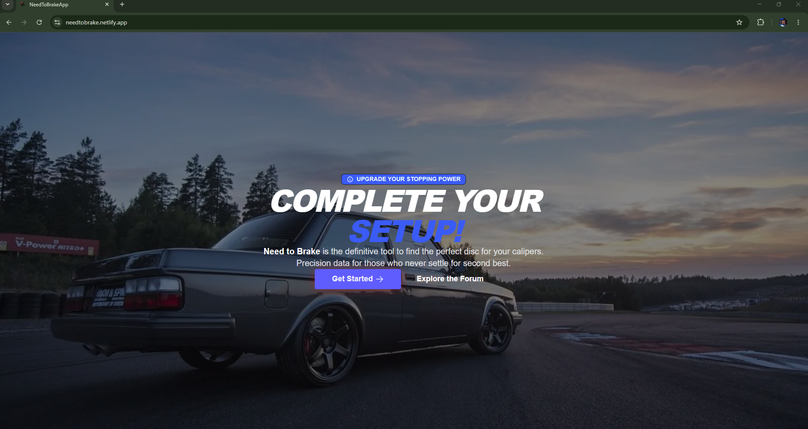
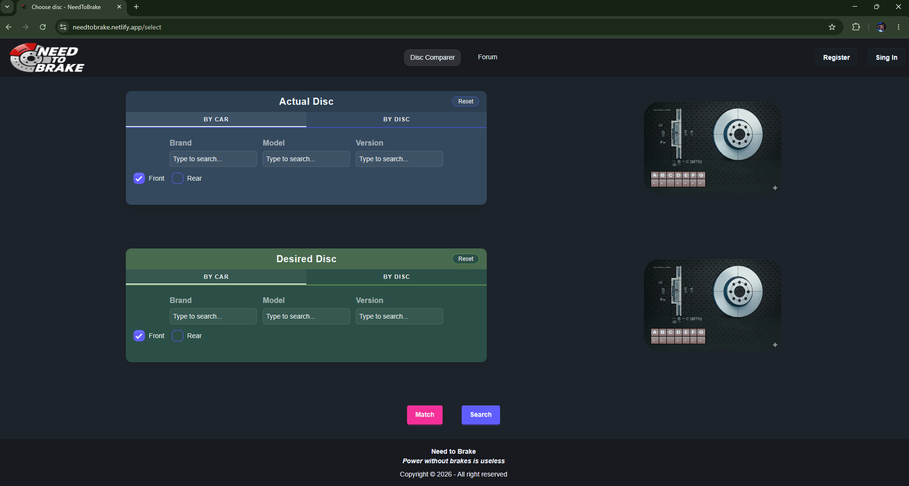
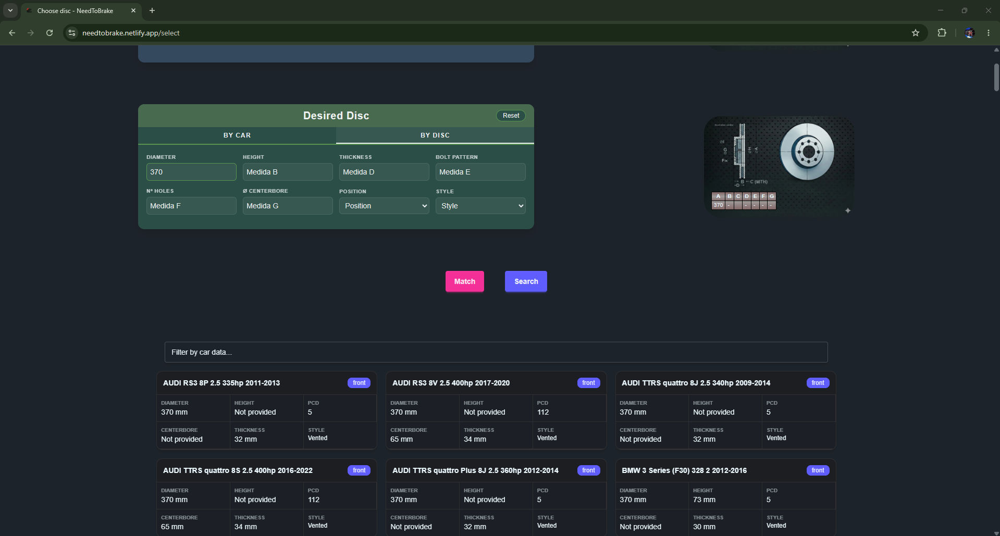
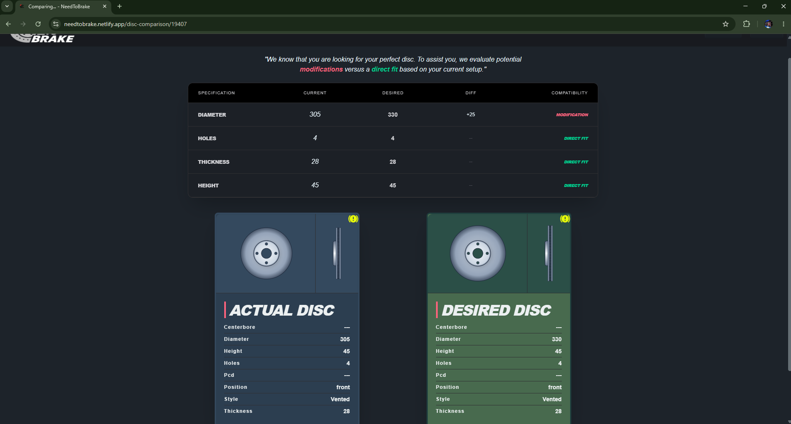
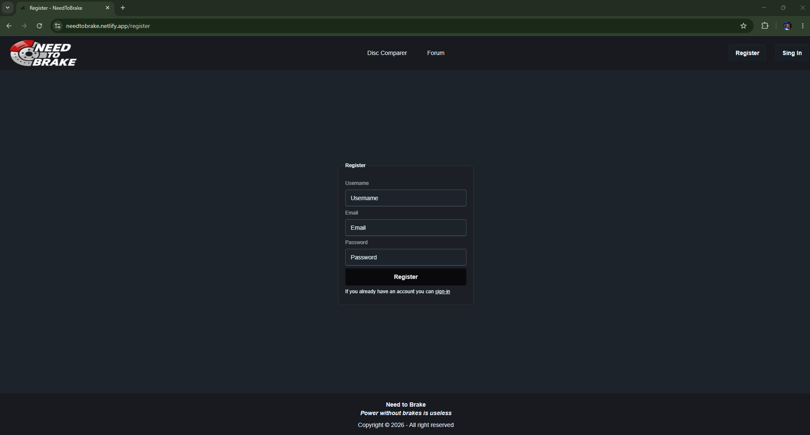
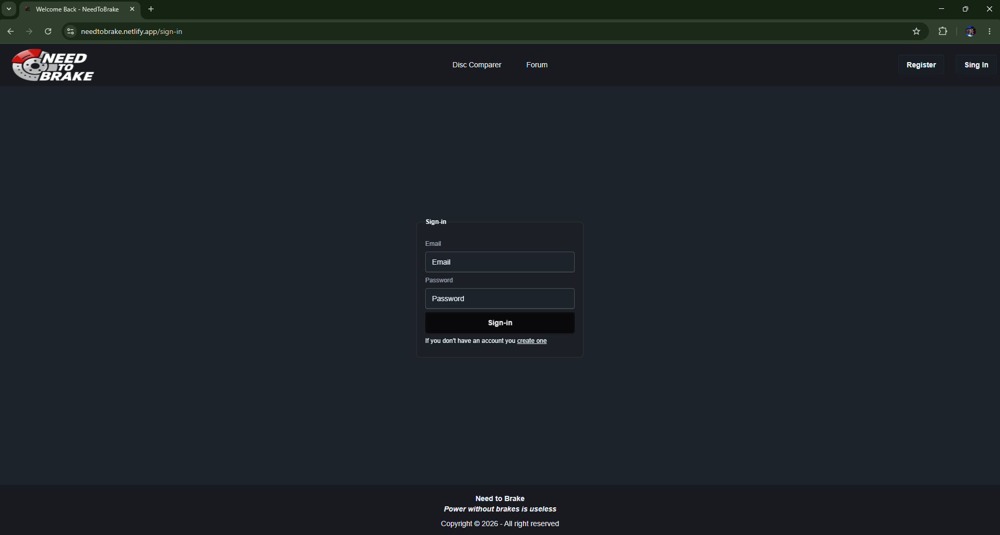
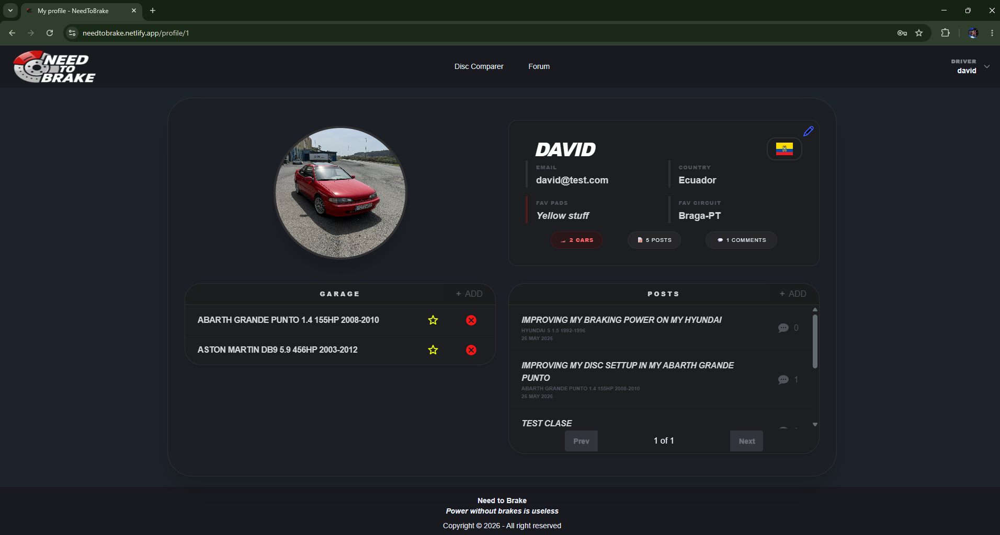
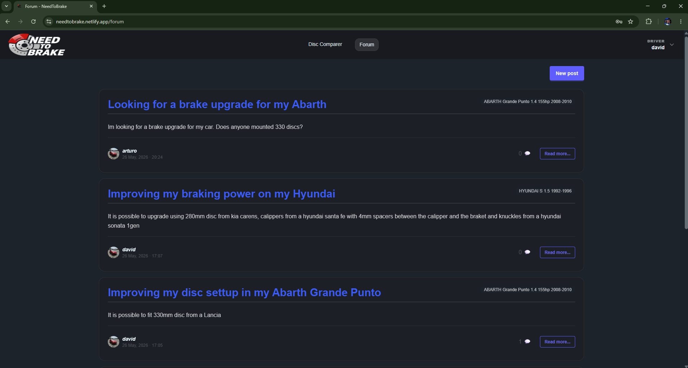
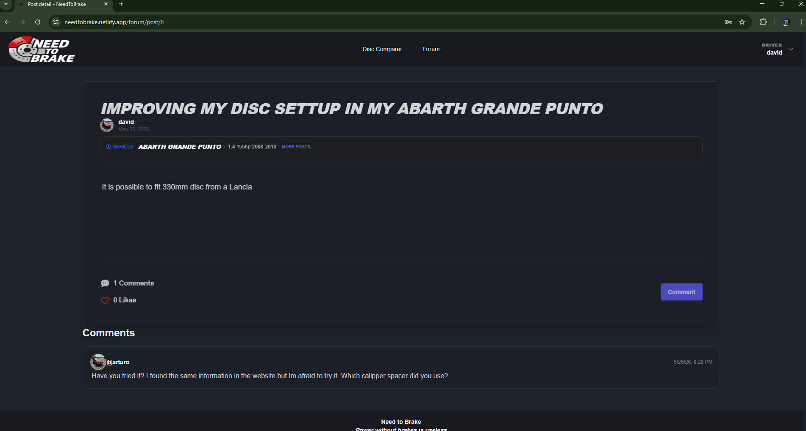

# NeedToBrake

Plataforma web para la **búsqueda, comparación y comunidad** en torno a discos de freno de coche. Permite localizar discos compatibles por marca, modelo y versión, comparar medidas con una representación visual a escala, tener un perfil personalizable, incluído un garaje virtual y participar en un foro publicando post, comentando o dando "like".

---

## Índice

1. [Descripción del proyecto](#descripción-del-proyecto)
2. [Arquitectura](#arquitectura)
3. [Requisitos previos](#requisitos-previos)
4. [Configuración](#configuración)
5. [Ejecución en local](#ejecución-en-local)
6. [Base de datos](#base-de-datos)
7. [Endpoints principales](#endpoints-principales)
8. [Tests](#tests)
9. [Demo y despliegue](#demo-y-despliegue)

---

## Descripción del proyecto

NeedToBrake es un TFG compuesto por:

- **Backend** — API REST construida con FastAPI (Python) y SQLModel sobre MySQL, con autenticación stateless mediante JWT.
- **Frontend** — Single Page Application en Angular 20 con renderizado visual interactivo de discos usando Konva.js, estilos con Tailwind CSS v4 y DaisyUI.
- **Infraestructura** — Contenedores Docker para desarrollo local; en producción: MySQL en Aiven, API en Render y SPA en Netlify.

Funcionalidades principales:

- Búsqueda de discos de freno por selección en cascada (Marca → Modelo → Versión → Año) y por filtros de medidas.
- Comparativa visual a escala entre dos discos utilizando(Konva.js).
- Foro con publicaciones, comentarios y sistema de likes con datos en vivo.
- Garaje personal por usuario con vehículo favorito.
- Perfil de usuario con avatar en Cloudinary y selección de nacionalidad mediante la API RestCountries.

---

## Arquitectura

```
NeedToBrakeApp/
├── backend/               # FastAPI + SQLModel + Alembic
│   ├── app/
│   │   ├── routes/        # Routers FastAPI por dominio
│   │   ├── services/      # Lógica de negocio
│   │   ├── repository/    # Acceso a datos
│   │   ├── models/        # Modelos Pydantic y SQLModel
│   │   ├── alembic/       # Migraciones de base de datos
│   │   └── Data/          # catálogo JSON (+600000 líneas)
│   ├── .env.example
│   └── requirements.txt
├── frontend/              # Angular 20
│   └── src/app/
├── docker-compose.yml     # Backend + MySQL
└── Makefile               # Comandos para backend
```

---

## Requisitos previos

### Para ejecución con Docker (recomendado)

| Herramienta    | Versión mínima |
| -------------- | -------------- |
| Docker         | 24+            |
| Docker Compose | v2+            |
| Make           | cualquiera     |

### Para ejecución manual

| Herramienta | Versión mínima |
| ----------- | -------------- |
| Python      | 3.11+          |
| Node.js     | 20+            |
| Angular CLI | 20+            |
| MySQL       | 8.0            |

### Cuentas externas necesarias

- **Cloudinary** — almacenamiento de avatares de usuario ([cloudinary.com](https://cloudinary.com))
- **Aiven** _(solo producción)_ — base de datos MySQL

---

## Configuración

### 1. Variables de entorno del backend

Copia el archivo de ejemplo y rellena los valores:

```bash
cp backend/.env.example backend/.env
```

Contenido del `.env`:

```env
# JWT
SECRET_KEY=tu_clave_secreta_larga_y_aleatoria
ALGORITHM=HS256
ACCESS_TOKEN_EXPIRE_MINUTES=60

# Base de datos (MySQL local con Docker)
DATABASE_URL=mysql+pymysql://user_develop:user_password@db:3306/NTB_DB

# Cloudinary
CLOUDINARY_NAME=tu_cloud_name
CLOUDINARY_API=tu_api_key
CLOUDINARY_SECRET=tu_api_secret
CLOUDINARY_URL=cloudinary://tu_api_key:tu_api_secret@tu_cloud_name
```

> **Nota:** la `DATABASE_URL` del ejemplo usa el hostname `db`, que es el nombre del servicio MySQL dentro de la red Docker. Si ejecutas el backend fuera de Docker, cámbialo por `localhost`.

---

## Ejecución en local

### Con Docker (recomendado)

```bash
# 1. Construir y levantar backend + base de datos en segundo plano
make detached

# 2. Aplicar migraciones (primera vez o tras cambios de esquema)
make migrate-up

# 3. Cargar el catálogo de discos y vehículos, aunque se deberia ejecutar de forma automática
docker compose exec backend bash -c "cd app && python run_seed.py"
```

El backend queda disponible en `http://localhost:8000`.

Para parar:

```bash
make down
```

### Backend sin Docker

```bash
cd backend
python -m venv .venv
source .venv/bin/activate          # Windows: .venv\Scripts\activate
pip install -r requirements.txt


cd app
alembic upgrade head
python run_seed.py
uvicorn main:app --reload --host 0.0.0.0 --port 8000
```

### Frontend

```bash
cd frontend
npm install
ng serve
```

La SPA queda disponible en `http://localhost:4200`.

---

## Base de datos

El proyecto usa **MySQL 8.0** en desarrollo local (Docker) y producción (Aiven).

### Levantar la BD con Docker

Docker Compose levanta automáticamente el contenedor `ntb_database` con:

```
Host:     localhost:3306
Database: NTB_DB
User:     user_develop
Password: user_password
```

Los datos persisten en el volumen Docker `db_ntb`.

### Migraciones con Alembic

```bash
# Aplicar todas las migraciones pendientes
make migrate-up

# Generar una nueva migración (tras cambiar modelos)
make migrate-gen m="descripcion_del_cambio"
```

### Seed del catálogo

El catálogo maestro de vehículos y discos de freno se carga desde `backend/app/Data/catalogo_frenos_objetos.json`:

```bash
docker compose exec backend bash -c "cd app && python run_seed.py"
```

Solo es necesario ejecutarlo una vez. Si la BD ya tiene datos, el script los detecta y no duplica.

---

## Endpoints principales

La API completa está autodocumentada. Una vez levantado el backend accede a:

- **Swagger UI** → `http://localhost:8000/docs`

### Resumen por dominio

#### Autenticación y usuarios — `/user`

| Método | Ruta                      | Descripción                 | Auth |
| ------ | ------------------------- | --------------------------- | ---- |
| POST   | `/user/register`          | Registro de nuevo usuario   | —    |
| POST   | `/user/sign-in`           | Login, devuelve JWT         | —    |
| GET    | `/user/profile/{user_id}` | Obtener perfil de usuario   | JWT  |
| PATCH  | `/user/set-avatar`        | Subir avatar a Cloudinary   | JWT  |
| PATCH  | `/user/update-profile`    | Actualizar datos del perfil | JWT  |

#### Selección en cascada — `/cascade`

| Método | Ruta                           | Descripción            |
| ------ | ------------------------------ | ---------------------- |
| GET    | `/cascade/brands`              | Listado de marcas      |
| GET    | `/cascade/models/{brand_id}`   | Modelos de una marca   |
| GET    | `/cascade/versions/{model_id}` | Versiones de un modelo |

#### Discos — `/disc` y `/parent-selector` y `/filter`

| Método | Ruta                                            | Descripción                                       |
| ------ | ----------------------------------------------- | ------------------------------------------------- |
| GET    | `/disc/{disc_id}`                               | Detalle de un disco por ID                        |
| GET    | `/parent-selector/disc-by-model/{model_id}`     | Discos de un modelo                               |
| GET    | `/parent-selector/disc-by-version/{version_id}` | Discos de una versión                             |
| POST   | `/filter/disc`                                  | Filtrado de discos por cotas (diámetro, espesor…) |

#### Posts y foro — `/post`

| Método | Ruta                            | Descripción                | Auth |
| ------ | ------------------------------- | -------------------------- | ---- |
| POST   | `/post/create`                  | Crear publicación          | JWT  |
| GET    | `/post/latest?page=1&limit=5`   | Posts recientes (paginado) | —    |
| GET    | `/post/by-version/{version_id}` | Posts de una versión       | —    |
| GET    | `/post/by-user/{user_id}`       | Posts de un usuario        | —    |
| GET    | `/post/{post_id}`               | Detalle de un post         | JWT  |

#### Comentarios — `/comment`

| Método | Ruta                                        | Descripción                       | Auth |
| ------ | ------------------------------------------- | --------------------------------- | ---- |
| POST   | `/comment/create`                           | Crear comentario                  | JWT  |
| PUT    | `/comment/modify`                           | Editar comentario propio          | JWT  |
| DELETE | `/comment/delete/{comment_id}`              | Eliminar comentario propio        | JWT  |
| GET    | `/comment/by-post/{post_id}?page=1&limit=5` | Comentarios de un post (paginado) | —    |

#### Likes — `/like`

| Método | Ruta                     | Descripción        | Auth |
| ------ | ------------------------ | ------------------ | ---- |
| POST   | `/like/{post_id}/like`   | Dar like a un post | JWT  |
| DELETE | `/like/{post_id}/unlike` | Quitar like        | JWT  |

#### Garaje — `/garage`

| Método | Ruta                                              | Descripción                  | Auth |
| ------ | ------------------------------------------------- | ---------------------------- | ---- |
| POST   | `/garage/add`                                     | Añadir vehículo al garaje    | JWT  |
| GET    | `/garage/get-all-garage/{user_id}`                | Ver garaje del usuario       | JWT  |
| PATCH  | `/garage/set-favourite`                           | Marcar vehículo favorito     | JWT  |
| PATCH  | `/garage/unset-garage-fav`                        | Desmarcar favorito           | JWT  |
| DELETE | `/garage/delete-garage-item/version/{version_id}` | Eliminar vehículo del garaje | JWT  |

#### Salud del servicio

| Método | Ruta            | Descripción                   |
| ------ | --------------- | ----------------------------- |
| GET    | `/health-check` | Estado de la API              |
| GET    | `/git-with-db`  | Estado de API + conexión a BD |

> Todos los endpoints protegidos esperan el header `Authorization: Bearer <token>`.

---

## Tests

```bash
# Ejecutar tests dentro del contenedor Docker
make test

# Con reporte de cobertura
make test-cov
```

Los tests se encuentran en `backend/app/test/`.

---

## Demo y despliegue

### URLs de producción

| Servicio             | URL                                        |
| -------------------- | ------------------------------------------ |
| Frontend (Netlify)   | `https://needtobrake.netlify.app`          |
| Backend API (Render) | `https://needtobrakeapp.onrender.com`      |
| Swagger producción   | `https://needtobrakeapp.onrender.com/docs` |

### Capturas de pantalla

📸 CAPTURAS DE PANTALLA

### Página de inicio



### Página de búsqueda



### Página de búsqueda con resultados



### Página de comparación



### Página de registro



### Página de inicio de sesión



### Página de perfil



### Página del foro



### Página de detalle de publicación



## Stack tecnológico

| Capa                 | Tecnología                                |
| -------------------- | ----------------------------------------- |
| Backend              | Python 3.13, FastAPI , SQLModel , Alembic |
| Autenticación        | PyJWT , bcrypt                            |
| Base de datos (dev)  | MySQL 8.0 (Docker)                        |
| Base de datos (prod) | MySQL (Aiven)                             |
| Frontend             | Angular 20, TypeScript 5.9                |
| Estilos              | Tailwind CSS v4, DaisyUI 5                |
| Visualización        | Konva.js 10 (Canvas HTML5)                |
| Almacenamiento media | Cloudinary                                |
| API's externas       | RESTCountries                             |
| Contenedores         | Docker, Docker Compose                    |
| CI/CD                | GitHub Actions                            |
| Hosting              | Render (Backend), Netlify (Frontend)      |
| Automatation         | GitHub Actions, cron-job                  |
